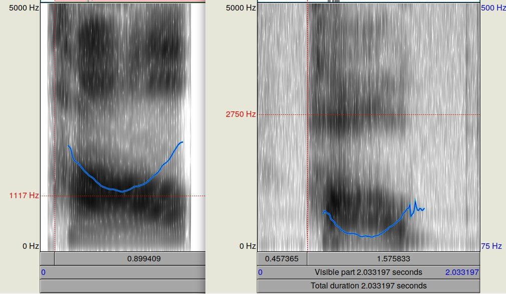

# Tone drills using Praat quickstart guide

Praat can be a very useful tool for training your Chinese tones. This quickstore guide will help you get up and running without having to dive into the advanced features of Praat.

## Setup

Download and install Praat for you OS. http://www.fon.hum.uva.nl/praat/

Download the free tone drills from https://www.sinosplice.com/learn-chinese/tone-pair-drills . Unzip the audio files in a convienent location.

Start Praat.

## Using Praat

Praat is quite advanced software with a lot of features. However, we only need a few things to start our tone drills.

Close all windows except the "Praat Objects" window.

First we will open and listen to an example audio fragment.

1. Select Open -> read from file
    * Navigate to the unzipped audio files, for example located in `.../Sinosplice Tone Pair Drills/Audio/1-Char Adj`
    * Open one or more file that end with `.mp3`
2. Select a sound, then click View&Edit
3. This opens a new window that shows the spectrogram (black) and pitch (blue line) of the audio. If you do not see a blue line, select Pitch -> Show pitch
4. Pressing any of grey buttons on the bottom will play the sound

Next we will record and analyze our own pronounciation.

1. In the Praat Objects window, go to New -> Record mono Sound
2. This opens the SoundRecorder window. Click record to record your own voice through your computers microphone.
3. Press Stop to stop the recording. Press save to list to save your recording.
4. In the Praat Objects window, you can find your recording at the bottom of the list. Select it and then click View&Edit
5. Just like above, this will show the spectrogram and pitch of the audio, this time your own recording.

Compare the blue pitch line of the native speaker to your pitch line. Try to mimick the native speaker. Repeat until satisfied.

*Left: native speaker pronouncing 好. Right: me pronouncing 好. My pitch is much lower but the blue line follows a similar curve.*

Good luck!